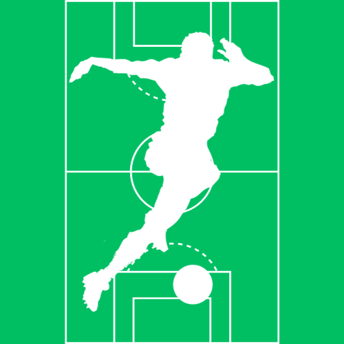

<div id="top"></div>
<!--
*** Thanks for checking out the Best-README-Template. If you have a suggestion
*** that would make this better, please fork the repo and create a pull request
*** or simply open an issue with the tag "enhancement".
*** Don't forget to give the project a star!
*** Thanks again! Now go create something AMAZING! :D
-->

<!-- PROJECT SHIELDS -->

<!--
*** I'm using markdown "reference style" links for readability.
*** Reference links are enclosed in brackets [ ] instead of parentheses ( ).
*** See the bottom of this document for the declaration of the reference variables
*** for contributors-url, forks-url, etc. This is an optional, concise syntax you may use.
*** https://www.markdownguide.org/basic-syntax/#reference-style-links
-->

<!-- PROJECT LOGO -->

<br />
<div align="center">
  <a href="https://github.com/othneildrew/Best-README-Template">
    
  </a>

<h3 align="center">Football Tournament</h3>

<p align="center">
    Game to simulates the brazillian divisions on football and the libertadores cup with generic players!
    <br />
    <!--
    <a href="https://github.com/othneildrew/Best-README-Template"><strong>Explore the docs »</strong></a>
    <br />
    <br />
    <a href="https://github.com/othneildrew/Best-README-Template">View Demo</a>
    ·
    <a href="https://github.com/othneildrew/Best-README-Template/issues">Report Bug</a>
    ·
    <a href="https://github.com/othneildrew/Best-README-Template/issues">Request Feature</a>
  </p>
  -->
</div>

<!-- TABLE OF CONTENTS -->

<details>
  <summary>Table of Contents</summary>
  <ol>
    <li>
      <a href="#about-the-project">About The Project</a>
      <ul>
        <li><a href="#built-with">Built With</a></li>
      </ul>
    </li>
    <li>
      <a href="#getting-started">Getting Started</a>
      <ul>
        <li><a href="#prerequisites">Prerequisites</a></li>
        <li><a href="#installation">Installation</a></li>
      </ul>
    </li>
    <li><a href="#usage">Usage</a></li>
    <li><a href="#roadmap">Roadmap</a></li>
    <li><a href="#contributing">Contributing</a></li>
    <li><a href="#license">License</a></li>
    <li><a href="#contact">Contact</a></li>
    <li><a href="#acknowledgments">Acknowledgments</a></li>
  </ol>
</details>

<!-- ABOUT THE PROJECT -->

## About The Project

<!--
[![Product Name Screen Shot][product-screenshot]](https://example.com)
-->

This project was created to get fake data and statistcs about my favorite sport. So i built this system to generate football data.

Championships:

* Campeonato brasileiro serie A
* Campeonato brasileiro serie B
* Campeonato brasileiro serie C
<!-- * Libertadores da America  -->
<!-- * Copa do Brasil -->
<!-- * Liga Profesional de Futbol (ARG) -->

I do not own the rights of any of this. It's just for fun.

<p align="right">(<a href="#top">back to top</a>)</p>

### Built With

* [Python](https://python.org/)
* [Pandas](https://pandas.pydata.org/)
* [Mysql](https://www.mysql.com/)
* [Matplotlib](https://matplotlib.org/)
* [Jupyter](https://jupyter.org/)
* [Docker](https://www.docker.com/)

<p align="right">(<a href="#top">back to top</a>)</p>

<!-- GETTING STARTED -->

## Getting Started


### Prerequisites

This is an example of how to list things you need to use the software and how to install them.

* pip

  ```py
  python3 -m pip install -r requirements.txt
  ```

### Installation using local mysql
---

1. Clone the repo
    ```sh
      git clone https://github.com/Rochamarc/tournament
    ```
2. Initialize Database 
    ```sh
      ./database_initialize.sh mysql_user mysql_password
    ```
3. Change config.json like the following example
    ```json
      {
        "port": 3306,
        "host": "localhost",
        "user": "mysqluser",
        "password": "mysqlpassword",
        "database": "databasename"
      }
    ```
4. Exec shell script to initialize database
    ```sh
      ./database_initialize.sh ${MYSQL_USER} ${MYSQL_PASSWORD}
    ```
5. Run the main code
    ```py
      python main.py
    ```

### Installation with docker compose
---
1. Clone the repo
    ```sh
      git clone https://github.com/Rochamarc/tournament
    ```
2. Build docker database
    ```sh
      docker build -t tournament-db .
    ```
3. Start docker container
    ```sh
      docker compose up -d
    ```
4. Exec container bash
    ```sh
      docker exec -it <container-id> bash
    ```
5. Exec shell script to initialize database
    ```sh
      ./database_initialize.sh ${MYSQL_USER} ${MYSQL_PASSWORD}
    ```
6. Change config.json like the following example, on the root directory and NameGenerator directory
    ```json
      {
        "port": 5500,
        "host": "localhost",
        "user": "mysqluser",
        "password": "mysqlpassword",
        "database": "databasename"
      }
    ```
7. Run the main code
    ```py
      python main.py
    ```

<p align="right">(<a href="#top">back to top</a>)</p>

<!-- OTHER MD FILES -->

## Other Docs

* [Classes](./docs/classes.md)
* [Tournament](./docs/tournament.md)
* [Database](./docs/database.md)
* [Controllers](./docs/controllers.md)
* [NameGenerator](./docs/name_generator.md)


## Database

To change information on main database, just add changes on the json file  

```sh
  ./config.json
```

---
To change information on name database, just add changes on the json file  

```sh
  ./NameGenerator/config.json
``` 

## Versions

* [Mysql 5.7](https://downloads.mysql.com/docs/refman-5.7-en.pdf) 
* [Python 3.10.12](https://docs.python.org/3.10/) 


<!-- USAGE EXAMPLES -->
<!--
## Usage

Use this space to show useful examples of how a project can be used. Additional screenshots, code examples and demos work well in this space. You may also link to more resources.

_For more examples, please refer to the [Documentation](https://example.com)_

-->
<p align="right">(<a href="#top">back to top</a>)</p>

<!-- ROADMAP -->

<!--
## Roadmap

- [x] Add Changelog
- [x] Add back to top links
- [ ] Add Additional Templates w/ Examples
- [ ] Add "components" document to easily copy & paste sections of the readme
- [ ] Multi-language Support
    - [ ] Chinese
    - [ ] Spanish

See the [open issues](https://github.com/othneildrew/Best-README-Template/issues) for a full list of proposed features (and known issues).

<p align="right">(<a href="#top">back to top</a>)</p>
-->

<!-- CONTRIBUTING -->

<!--
## Contributing

Contributions are what make the open source community such an amazing place to learn, inspire, and create. Any contributions you make are **greatly appreciated**.

If you have a suggestion that would make this better, please fork the repo and create a pull request. You can also simply open an issue with the tag "enhancement".
Don't forget to give the project a star! Thanks again!

1. Fork the Project
2. Create your Feature Branch (`git checkout -b feature/AmazingFeature`)
3. Commit your Changes (`git commit -m 'Add some AmazingFeature'`)
4. Push to the Branch (`git push origin feature/AmazingFeature`)
5. Open a Pull Request


<p align="right">(<a href="#top">back to top</a>)</p>
-->

<!-- LICENSE -->

## License

Distributed under the MIT License. See `LICENSE.txt` for more information.

<p align="right">(<a href="#top">back to top</a>)</p>

<!-- CONTACT -->

## Contact

Marcos Rocha - [@Nuke_TheCross](https://twitter.com/Nuke_TheCross) - rochadcmarcos@gmail.com

Project Link: [https://github.com/Rochamarc/tournament](https://github.com/Rochamarc/tournament)

<p align="right">(<a href="#top">back to top</a>)</p>

<!-- MARKDOWN LINKS & IMAGES -->

<!-- https://www.markdownguide.org/basic-syntax/#reference-style-links -->

[contributors-shield]: https://img.shields.io/github/contributors/othneildrew/Best-README-Template.svg?style=for-the-badge
[contributors-url]: https://github.com/othneildrew/Best-README-Template/graphs/contributors
[forks-shield]: https://img.shields.io/github/forks/othneildrew/Best-README-Template.svg?style=for-the-badge
[forks-url]: https://github.com/othneildrew/Best-README-Template/network/members
[stars-shield]: https://img.shields.io/github/stars/othneildrew/Best-README-Template.svg?style=for-the-badge
[stars-url]: https://github.com/othneildrew/Best-README-Template/stargazers
[issues-shield]: https://img.shields.io/github/issues/othneildrew/Best-README-Template.svg?style=for-the-badge
[issues-url]: https://github.com/othneildrew/Best-README-Template/issues
[license-shield]: https://img.shields.io/github/license/othneildrew/Best-README-Template.svg?style=for-the-badge
[license-url]: https://github.com/othneildrew/Best-README-Template/blob/master/LICENSE.txt
[linkedin-shield]: https://img.shields.io/badge/-LinkedIn-black.svg?style=for-the-badge&logo=linkedin&colorB=555
[linkedin-url]: https://linkedin.com/in/othneildrew
[product-screenshot]: images/screenshot.png
